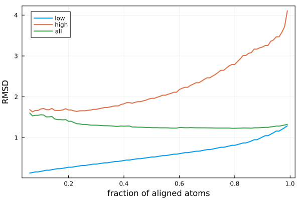
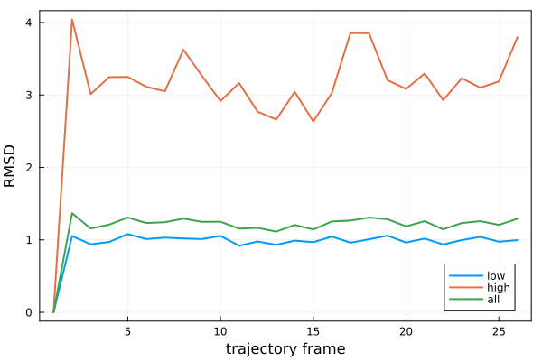
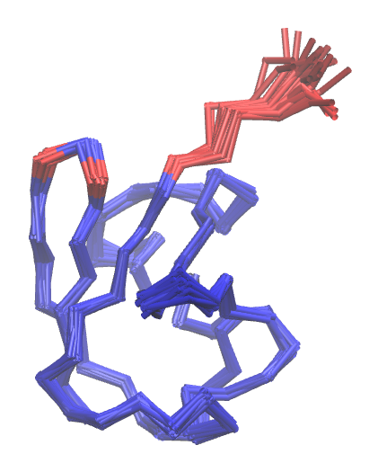

# MDLovoFit.jl

Julia interface for the [MDLovoFit](http://m3g.iqm.unicamp.br) package for analyzing the mobility of 
structures in MD simulations.  

## Installation

1. Install Julia using the [juliaup](https://github.com/JuliaLang/juliaup#juliaup---julia-version-manager) installer, on your platform.

2. Install the necessary packages with:

```julia
juila> import Pkg; Pkg.activate("MDLovoFit", shared=true) 

julia> Pkg.add(["MDLovoFit", "Plots"])
```

These commands will create an environment with the `MDLovoFit` and `Plots` packages installed,
within which the following example can be run.

## Example

### Computing the fraction of atoms that can be aligned at each precision

```julia
julia> import Pkg; Pkg.activate("MDLovoFit", shared=true) # activate environment

julia> using MDLovoFit, Plots

# PDB file of the system
julia> pdbfile = MDLovoFit.Testing.pdb_file 
# Loading a trajectory: Gromacs XTC in this example
julia> trajectory = MDLovoFit.Testing.trajectory_file # Gromacs trajecotry

julia> mf = map_fractions("protein and name CA", pdbfile, trajectory)
------------------
MapFractionsResult
------------------
Greatest fraction for which the RMSD-low is smaller than 1: 0.89

fraction contains the fraction of atoms considered in the alignment.
rmsd_low contains the RMSD of the fraction of the structure with the lowest RMSD.
rmsd_high contains the RMSD of the fraction not considered for the alignment.
rmsd_all contains the RMSD of the whole structure.

julia> plot(
           mf.fraction,
           [mf.rmsd_low mf.rmsd_high mf.rmsd_all],
           label=["low" "high" "all"],
           xlabel="fraction of aligned atoms",
           ylabel="RMSD",
           linewidth=2, framestyle=:box
       )
```

Will produce the following plot:



### Aligning the trajectory

In the plot above, we see that about 90% of the atoms can be 
aligned with an RMSD of less than 1 Angstrom. Now we align the 
complete trajectory using this fraction as a criterium:

```julia
julia> r = mdlovofit(
           "protein and name CA", pdbfile, 
           trajectory, 
           fraction = 0.9, 
           output_pdb="aligned.pdb"
       )
---------------
MDLovoFitResult
---------------

Aligned pdb file: aligned.pdb
Number of frames considered: 26
Average RMSD of all atoms: 1.18
Average RMSD of the 90.0% atoms of lowest RMSD: 0.96
Average RMSD of the 10.0% atoms of highest RMSD: 3.09

Frame indices availabe in result.iframe
RMSD data availabe in rmsd_low, rmsd_high, and rmsd_all

RMSF data availabe in result.rmsf (Number of atoms: 76)

julia> plot(
           r.iframe,
           [r.rmsd_low r.rmsd_high r.rmsd_all],
           label=["low" "high" "all"],
           xlabel="trajectory frame",
           ylabel="RMSD",
           linewidth=2, framestyle=:box
       )
```

Which will produce the following figure:



Showing the RMSD as a function of the step of the trajectory for each subset of the protein.

The `aligned.pdb` file produced in the execution of `mdlovofit` above contains the frames aligned, and th `occupancy` field of the
atoms indicate if they are, or not, used in the alignment. Visualizing the frames superimposed in VMD, and colored by `occupancy`, we get:



which illustrates the low and high mobility regions of the protein.

For additional information go to [MDLovoFit](http://m3g.iqm.unicamp.br/mdlovofit). 

## Reference

Please cite the following reference if MDLovoFit was useful:

- L. Martínez, **Automatic identification of mobile and rigid substructures in molecular dynamics simulations and fractional structural fluctuation analysis.** PLoS One 10(3): e0119264, 2015. [[LINK]](http://journals.plos.org/plosone/article?id=10.1371/journal.pone.0119264)


